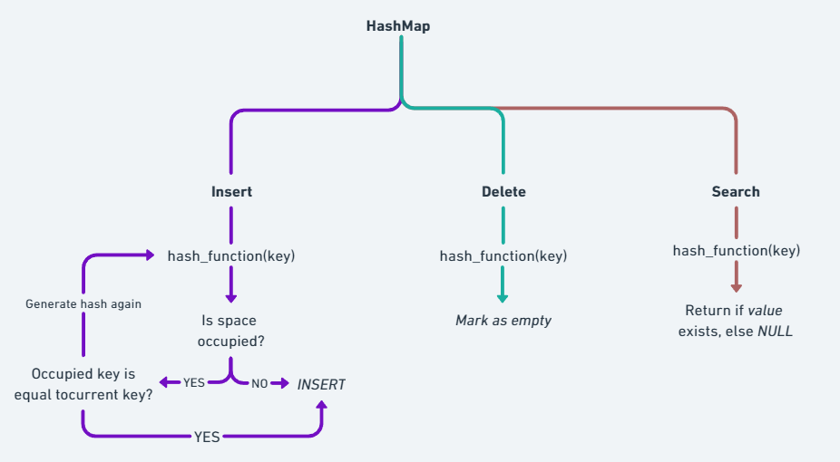

# HashMap Implementation in C

This is a simple HashMap implementation in C, utilizing standard libraries and a simple hashing algorithm, combined with the open addressing hash collision technique.

## Pre-Requisites
- CC/GCC
- GNU make

On linux systems, run the command:
```bash 
sudo apt install make
``` 

## Installation

Clone the repository onto your local machine using git:

```bash
git clone https://github.com/Serpent03/HashMap-In-C.git
```

## Overview

```/build``` stores all the executables that are linked together from the source files. ```/src``` holds all the source code, including the header file, which is ```common.h```, the library file ```hash_lib.c```, the main file and the makefile.



## Future Ideas

- Find a way to hold all types of data, not just string based ones.
- Develop into a common C library for common data structures.
- Change the collision resolution technique to closed addressing or provide an option for, depending on the situation.
- Automatically change the numbers of bucket on initialization when adding data to the hashmap.
